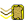

# 🌐 **Windows Century**
A browser‑native operating system simulation with a persistent virtual filesystem, modular apps, and a retro‑inspired window manager — all running client‑side.

<p align="center">
  
</p>

---

## 🚀 Overview
Windows Century is a fake OS that runs entirely in your browser.  
It’s inspired by the Windows93/96/97/99 lineage, but built with a more simple approach.

The system includes:

- A persistent virtual filesystem  
- A window manager  
- Built‑in apps  
- A simple app framework  
- A reset mechanism  
- No backend, no servers, no tracking  

Everything lives inside the browser.

### Notes

1. The GitHub Pages hosting of Windows Century isn't working right now. Soon I'll set up yet another server and host it there, but in the meantime you can get Python, run `python3 -m http.server` in Windows Century's directory, and go to localhost:8000 in your browser. Don't worry, you'll see later that (spoiler alert) the user files aren't on server's disk, it's on client's disk, so you'll have so much space.

2. If you want a normal reset, reset once. If you want to reset the apps too and get the new version or new apps, reset twice.

---

## 📁 Filesystem
Windows Century stores its entire virtual disk in the browser’s storage as:

```
w97.json
```

This file contains:

- Directories  
- Files  
- Installed apps  
- User data  

The OS loads this file at boot and saves changes automatically.

Don't save an ISO, as the entire filesystem is in memory too.

---

## 🧩 Built‑in Apps
Windows Century includes several basic apps:

- **Notes** — Create and save text files like you haven't ever!  
- **Text Reader** — Open and view files the cool way.
- **Image Viewer** — Load images from URLs!
- **Files** — Browse directories in just a few clicks and types.
- **Reset this PC** — Reinstall the OS swiftly and easily.
- **sb.js** — ooh pretty images
- **Turbo-V** — Emulate many OSes, including Windows 96-97, and Windows Century.
- **Splinternet Opener** — Browse the web with a small interface whilst feeling Windows Centuric.
- **Import File** — Imports a file from... vrrrrr... the... real OS.
- **Cracking the Doorway** — My fangame!
- **gato.js** — Moew
- **Century News** — View some totally real news on your Century computer.
- **CenturyAI** — Talk to a definitely LLM AI on your Century PC.
- **Notes 2.0** — Thought I wouldn't update Notes? WRONG! This is an updated version, after updating the internals to match the things normal users and developers need.
- **Century Packages** — Install stuff 'n' apps from a repo you define!
- **Settings** — Change settings with ease.
- **CodeEdit** — Very simple syntax highlighter.
- **DownloadTool** — Want a highly specific file but no single Century Packages repo has it? Go for the internet and download it using DownloadTool!
- **MusicListen** — Vibe with the groove simply.
- **MarkThatDown** — Eat up some Markdown and spit it out as HTML.

Apps live under `/apps/` inside the virtual filesystem.

---

## 🪟 UI Framework
Apps are built using a small UI toolkit located under `/system/ui/ui.js`:

- `WindowCreator` — build window contents  
- `renderWindow(title, body, width, height)` — display a window  
- Inputs, buttons, text, images, iframes, etc.  

This makes it easy to create new apps with minimal boilerplate.

If you want to make an app that uses the filesystem, the FS interface lives under `/system/important/fs.js`:

- `listDir(path)` — returns `[name, value]` pairs  
- `createDirTreeTo(path)` — ensures a directory path exists  
- `newFile(path, name, contents)` — create a file  
- `readFile(path, name)` — read a file  
- `removeFile(path, name)` — delete a file  
- `copyFile(path1, name1, path2, name2)` — copy a file  
- `renameFile(path, name, newName)` — rename a file  
- `reinstall()` — reinstall Windows Century  
- `splitFilenamePath()` — split a path into filename and path

> *“But why can’t I just write to system?”*  
> Because the system is the real website, not the virtual filesystem.  
> You’re editing the OS, not the server. Okay?
> *“But why is the OS internals on the server and not in the FS?”*
> Because I tested & created UI before FS :(

---

## 🔄 Resetting the OS
The **Reset this PC** app reinstalls the default filesystem.

If the reset button doesn’t work (rare browser storage issue), you can manually clear the OS storage:

### **Edge**
1. Open `edge://settings/privacy/cookies/allCookies`  
2. Search for your domain  
3. Delete the entry  
4. Restart the browser  

This fully wipes the virtual disk.

---

## 🛠️ Developing Apps
Apps are simple ES modules stored in `/apps/`.

Example structure:

```js
import { WindowCreator, renderWindow } from "/system/ui/ui.js";

const win = new WindowCreator();
var text = win.newText("Hello world");
win.newButton("Date.now me", function(){
    text.textContent = Date.now();
});
renderWindow("Foo bar bad baf doo", win.output, 400, 300);
```

The OS loads and runs apps dynamically.

---

## 📦 Project Structure
```
/system
    /ui             → window manager/UI toolkit + taskbar
    /important      → filesystem logic
    /libs           → libraries you may or may not need
    /startupscripts → startup scripts
    /script.js      → bootloader
index.html
(and more)

In CenturyFS:
/apps               → user apps
(and more)
```

---

## 🧪 Status
Windows Century is in early development.  
Expect rough edges, missing features, and occasional bugs.

---

[](http://creativecommons.org/licenses/by-sa/4.0/)
